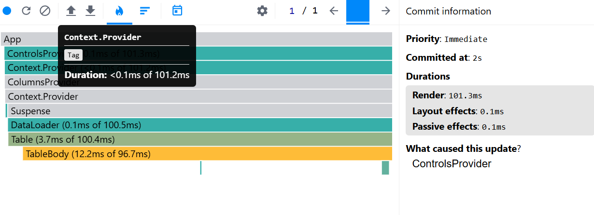
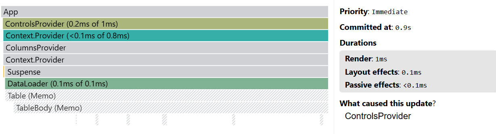
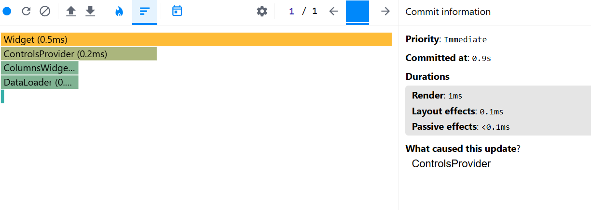
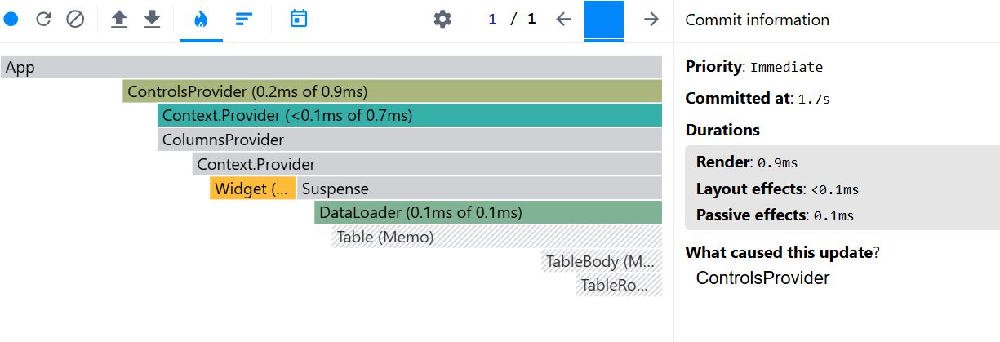
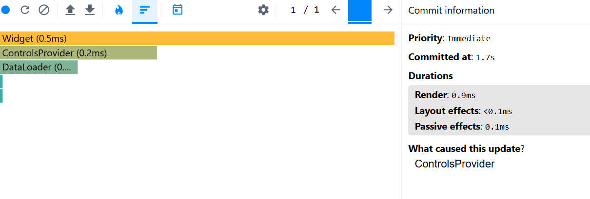
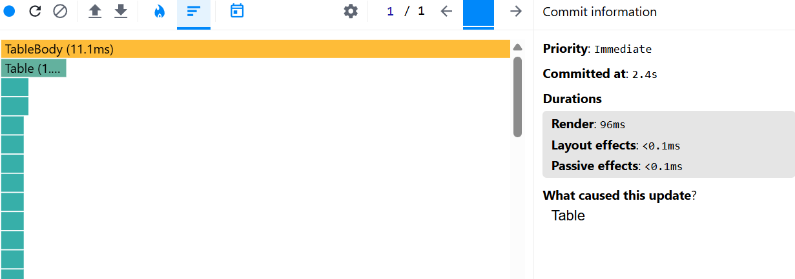
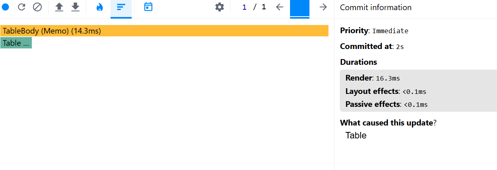
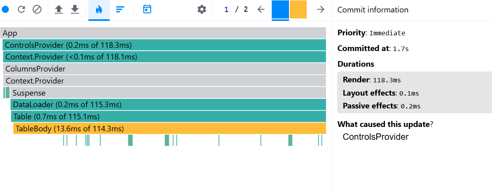
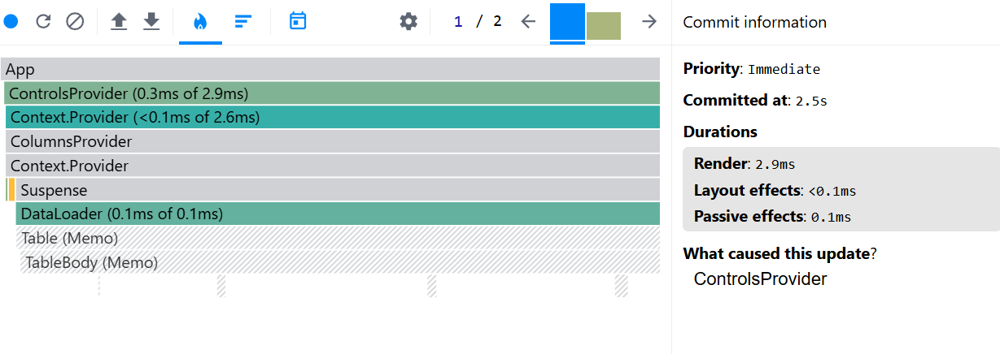
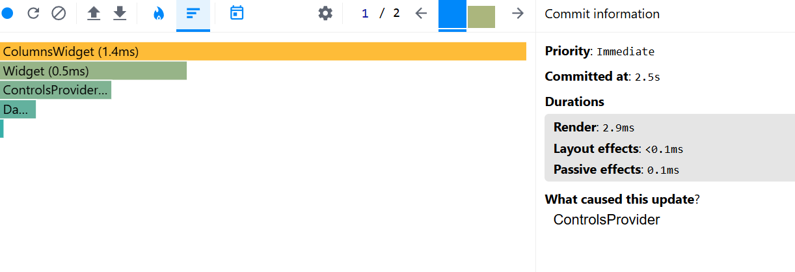

### Performance report

#### Selecting year

|              |                                   Before optimization                                    |                                                     After optimization |
| :----------- | :--------------------------------------------------------------------------------------: | ---------------------------------------------------------------------: |
| Commit       |                                         101.3ms                                          |                                                                    1ms |
| Render       | _DataLoader_: 0.1ms of 100.5ms; _Table_: 3.7ms of 100.4ms; _TableBody_: 12.2ms of 96.7ms | _DataLoader_: 0.1ms of 0.1ms; _Table_ and _TableBody_ did not rerender |
| Interactions |              Repeated pressing 'Apply button' with year input value = 2000               |          Repeated pressing 'Apply button' with year input value = 2000 |
| Flame Graph  |                                            |                         |
| Ranked Chart |                                            |                         |

#### Searching country

|              |                                Before optimization                                 |                                                     After optimization |
| :----------- | :--------------------------------------------------------------------------------: | ---------------------------------------------------------------------: |
| Commit       |                                       2.6ms                                        |                                                                  0.9ms |
| Render       | _DataLoader_: 0.2ms of 1.6ms; _Table_: 0.7ms of 1.4ms; _TableBody_: 0.2ms of 0.6ms | _DataLoader_: 0.1ms of 0.1ms; _Table_ and _TableBody_ did not rerender |
| Interactions |         Repeated pressing 'Apply button' with year input value = 'Bahrain'         |     Repeated pressing 'Apply button' with year input value = 'Bahrain' |
| Flame Graph  |                                      |                         |
| Ranked Chart |                                      |                         |

#### Sorting population

|              |                  Before optimization                   |                                      After optimization |
| :----------- | :----------------------------------------------------: | ------------------------------------------------------: |
| Commit       |                          96ms                          |                                                  16.3ms |
| Render       | _Table_: 1.4ms of 96ms; _TableBody_: 11.1ms of 94.3ms  | _Table_: 1.4ms of 16.3ms; _TableBody_: 14.3ms of 14.8ms |
| Interactions | Press "Population" head in table with the initial data |  Press "Population" head in table with the initial data |
| Flame Graph  |          |           |
| Ranked Chart |          |           |

#### Adding column

|              |                                    Before optimization                                    |                                                             After optimization |
| :----------- | :---------------------------------------------------------------------------------------: | -----------------------------------------------------------------------------: |
| Commit       |                                           118.3                                           |                                                                          2.9ms |
| Render       | _DataLoader_: 0.2ms of 115.3ms; _Table_: 0.7ms of 115.1ms; _TableBody_: 13.6ms of 114.3ms |         _DataLoader_: 0.1ms of 0.1ms; _Table_ and _TableBody_ did not rerender |
| Interactions |      Repeated pressing "Apply" button on columns modal with 'Methane' column chosen       | Repeated pressing "Apply" button on columns modal with 'Methane' column chosen |
| Flame Graph  |                                             |                                 |
| Ranked Chart |                                               |                                 |
