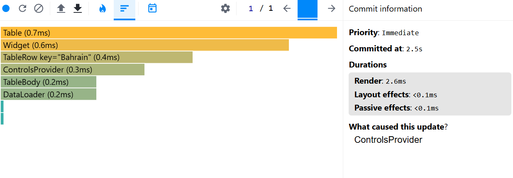
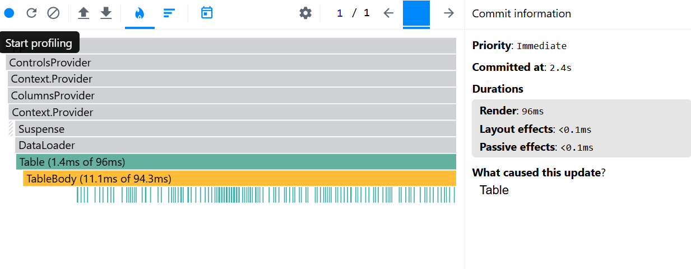
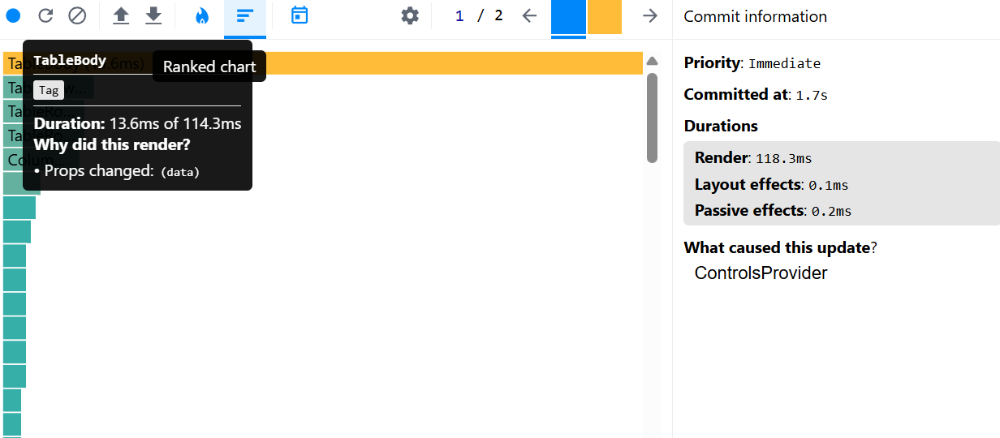

### Performance report

#### Selecting year

|              |                                   Before optimization                                    |                                After optimization |
| :----------- | :--------------------------------------------------------------------------------------: | ------------------------------------------------: |
| Commit       |                                         101.3ms                                          |                                                   |
| Render       | _DataLoader_: 0.1ms of 100.5ms; _Table_: 3.7ms of 100.4ms; _TableBody_: 12.2ms of 96.7ms |                                                   |
| Interactions |                    Press 'Apply button' with year input value = 2000                     | Press 'Apply button' with year input value = 2000 |
| Flame Graph  |                                                                  |                                                   |
| Ranked Chart |                                                                  |                                                   |

#### Searching country

|              |                                Before optimization                                 |                                     After optimization |
| :----------- | :--------------------------------------------------------------------------------: | -----------------------------------------------------: |
| Commit       |                                       2.6ms                                        |                                                        |
| Render       | _DataLoader_: 0.2ms of 1.6ms; _Table_: 0.7ms of 1.4ms; _TableBody_: 0.2ms of 0.6ms |                                                  $3.00 |
| Interactions |               Press 'Apply button' with year input value = 'Bahrain'               | Press 'Apply button' with year input value = 'Bahrain' |
| Flame Graph  |                                                            |                                                        |
| Ranked Chart |                                                            |                                                        |

#### Sorting population

|              |                  Before optimization                   |                                     After optimization |
| :----------- | :----------------------------------------------------: | -----------------------------------------------------: |
| Commit       |                          96ms                          |                                                        |
| Render       | _Table_: 1.4ms of 96ms; _TableBody_: 11.1ms of 94.3ms  |                                                        |
| Interactions | Press "Population" head in table with the initial data | Press "Population" head in table with the initial data |
| Flame Graph  |                                |                                                        |
| Ranked Chart |                                |                                                        |

#### Adding column

|              |                                    Before optimization                                    |                                                 After optimization |
| :----------- | :---------------------------------------------------------------------------------------: | -----------------------------------------------------------------: |
| Commit       |                                           118.3                                           |                                                                    |
| Render       | _DataLoader_: 0.2ms of 115.3ms; _Table_: 0.7ms of 115.1ms; _TableBody_: 13.6ms of 114.3ms |                                                                    |
| Interactions |            Press "Apply" button on columns modal with 'Methane' column chosen             | Press "Apply" button on columns modal with 'Methane' column chosen |
| Flame Graph  |                                                                   |                                                              $1.75 |
| Ranked Chart |                                                                     |                                                              $1.75 |
