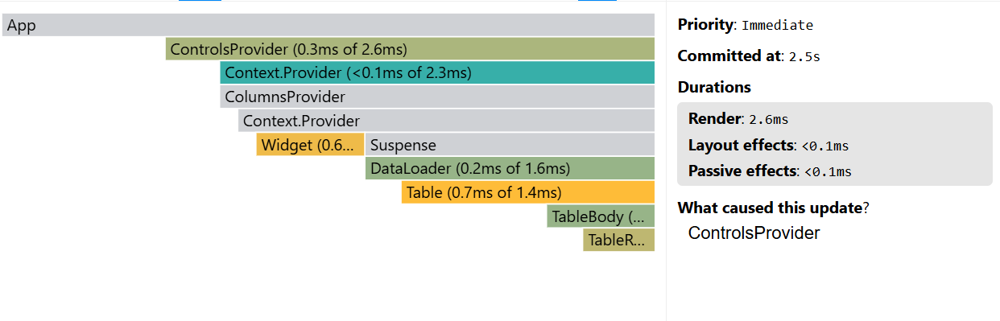

### Performance report

#### Selecting year

|              |                                  Before optimization                                   |                                After optimization |
| :----------- | :------------------------------------------------------------------------------------: | ------------------------------------------------: |
| Commit       |                                         86.3ms                                         |                                                   |
| Render       | _DataLoader_: 0.2ms of 84.7ms; _Table_: 0.6ms of 84.5ms; _TableBody_: 81.6ms of 83.9ms |                                                   |
| Interactions |                   Press 'Apply button' with year input value = 2000                    | Press 'Apply button' with year input value = 2000 |
| Flame Graph  |                                                                  |                                                   |
| Ranked Chart |                                                                |                                                   |

#### Searching country

|              |                                  Before optimization                                   |                                     After optimization |
| :----------- | :------------------------------------------------------------------------------------: | -----------------------------------------------------: |
| Commit       |                                         65.2ms                                         |                                                        |
| Render       | _DataLoader_: 0.1ms of 64.4ms; _Table_: 0.5ms of 64.4ms; _TableBody_: 61.2ms of 63.9ms |                                                  $3.00 |
| Interactions |                 Press 'Apply button' with year input value = 'Bahrain'                 | Press 'Apply button' with year input value = 'Bahrain' |
| Flame Graph  |                                                                |                                                        |
| Ranked Chart |                                                                |                                                        |

#### Sorting population

|              |                   Before optimization                   |                                     After optimization |
| :----------- | :-----------------------------------------------------: | -----------------------------------------------------: |
| Commit       |                         77.2ms                          |                                                        |
| Render       | _Table_: 0.8ms of 77.2ms; _TableBody_: 73.4ms of 76.4ms |                                                        |
| Interactions | Press "Population" head in table with the initial data  | Press "Population" head in table with the initial data |
| Flame Graph  |                                 |                                                        |
| Ranked Chart |                                 |                                                        |

#### Adding column

|              |                                  Before optimization                                   |                                                 After optimization |
| :----------- | :------------------------------------------------------------------------------------: | -----------------------------------------------------------------: |
| Commit       |                                          97.8                                          |                                                                    |
| Render       | _DataLoader_: 0.1ms of 96.7ms; _Table_: 0.8ms of 96.6ms; _TableBody_: 89.3ms of 95.7ms |                                                                    |
| Interactions |           Press "Apply" button on columns modal with 'Methane' column chosen           | Press "Apply" button on columns modal with 'Methane' column chosen |
| Flame Graph  |                                                                |                                                              $1.75 |
| Ranked Chart |                                                                |                                                              $1.75 |
